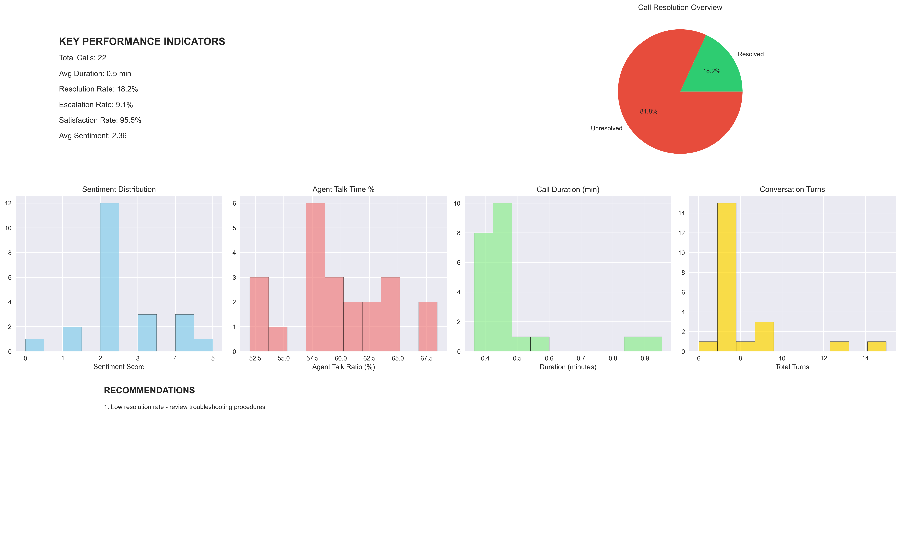

# Call Center Analytics 2.0 
A proof of concept using an LLM and latest speech processing tools

## From Raw Audio to Actionable Business Intelligence

I decided to build an updated version (2.0) of the [POC I had built earlier](https://github.com/rlagh2/callcenteranalytics) using the latest AI technology and see what can be improved. I have included the full code, the output, sample audio, and a script to create more audio files so anyone interested can run this code as a sample or use it to analyze their call center data to gain insights. This is a POC so, for production use, it would need scaling code and deployment to a highly available infrastructure, robust error handling, security, etc. I have also listed my lessons learned from this exercise below.

This repo is *educational/demo only and not intended for production* deployments. My main objective is to help uncover valuable insights buried in hours of recorded service calls.

### Lessons Learned

- Code Generation: I used Anthropic Claude to generate the code. It took a few iterations, but the final output mostly ran without needing much editing. I've had good success with Claude more than other LLMs for Python (and React Native) code generation. The trick I use is to ask for code in increments with concrete input and output rather than the full solution which can introduce bugs which are normally hard to detect and clean up. 

- Audio Data: Getting audio wasn't easy last time, but using OpenAI, I was able to easily generate WAV files from scripts that I generated with Claude. The code is included if you want to do the same.

- Insights from Data: I went into the project with some idea about which insights to extract from the audio data. But asking Claude for what else I could learn from the data introduced some valuable insights about customer satisfaction, agent performance including talk duration comparison between agents and customers, and operational efficiency. 

- Rather Obviously, the improvements in audio processing including diarization greately simplified the implementation.

### The Problem this Solution Aims to Solve

Call centers face several challenges:
- **Quality Assurance Bottlenecks**: Manual call reviews are slow and inconsistent
- **Performance Blind Spots**: Limited visibility into agent effectiveness and customer sentiment
- **Missed Opportunities**: Valuable insights buried in hours of recorded conversations
- **Reactive Management**: Issues discovered too late, after customer relationships are damaged
- **Compliance Risks**: Difficulty ensuring consistent service standards across all interactions

### The Solution: AI-Powered Speech Analytics

I've used ElevenLabs' speech-to-text API to automatically analyze call recordings and extract meaningful business intelligence. The solution provides a complete pipeline from audio processing to performance improvement recommendations.

However, note that although fully functional, this is not a production ready application. Rather, it is a proof of concept for using AI and the latest speech analytics tools to draw more insights from audio recordings by call centers.

## What's Included in This Project

### 🎯 Call Analysis
- **Automatic transcription** with speaker identification
- **Sentiment analysis** to gauge customer satisfaction
- **Call outcome detection** (resolved, escalated, callback needed)
- **Agent performance metrics** including talk ratios and response patterns
- **Audio quality assessment** for technical troubleshooting

### 📊 Performance Visualizations
- Charts showing performance trends
- A dashboard for quick decision-making
- Correlation analysis to identify improvement opportunities
- Quality distribution metrics across all calls

### 🔧 Testing & Development
- **Sample data generation** using OpenAI's text-to-speech for creating test calls
- **Batch processing** for multiple audio files
- **Multiple audio format support** (WAV, MP3, FLAC, M4A, OGG)
- **JSON export** for integration with existing systems

## The Technical Journey

### Phase 1: Speech-to-Text Foundation
I started with ElevenLabs' speech-to-text API, which provides:
- High-accuracy transcription with confidence scores
- Speaker diarization (who said what, when)
- Precise timing information for each word
- Support for various audio formats

### Phase 2: Business Intelligence Layer
Added analytics on top of raw transcription data:
- Natural language processing for sentiment detection
- Pattern recognition for call outcomes
- Statistical analysis of conversation dynamics

### Phase 3: Visualization and Reporting
Created comprehensive dashboards that transform data into insights:
- Multi-chart analytics showing different perspectives
- Correlation analysis revealing hidden patterns
- Executive summaries with actionable recommendations
- Exportable reports for stakeholder communication

## Real-World Impact

### For Call Center Managers
- **Reduce QA time**: Automated analysis replaces manual call reviews
- **Improve resolution rates**: Identify successful interaction patterns
- **Enhance agent training**: Data-driven coaching opportunities
- **Monitor customer satisfaction**: Real-time sentiment tracking

### For Operations Teams
- **Optimize staffing**: Understand call duration and complexity patterns
- **Improve processes**: Identify common escalation triggers
- **Ensure compliance**: Automated monitoring of service standards
- **Track performance**: Comprehensive metrics across all agents

### For Executives
- **Strategic insights**: Customer satisfaction trends and drivers
- **ROI measurement**: Quantify the impact of service improvements
- **Competitive advantage**: Data-driven customer experience optimization
- **Risk management**: Early warning system for service issues

## Getting Started

### Prerequisites
- Python 3.12+
- ElevenLabs API key (sign up at elevenlabs.io for free trial)
- OpenAI API key (for sample audio generation - if audio sample generation needed)
- Audio files in supported formats (WAV, MP3, FLAC, M4A, OGG) OR use the sample generator

### Quick Setup
```bash
# Clone the repository
git clone https://github.com/rlagh2/callcenteranalytics2.0.git
cd callcenteranalytics2.0

# Install dependencies
pip install -r requirements.txt

# Create a .env file in the root directory and add:
ELEVENLABS_API_KEY=your_key_here
OPENAI_API_KEY=your_key_here

# Option 1: Use your own call recordings
cd audio
# Copy your audio files to the audio folder

# Option 2: Generate sample data for testing
python generate_sample_audio.py  # Creates realistic test calls from the dialogues.json transcripts using OpenAI.

# Run the analysis
python call_center_analytics.py

# Generate visualizations
python analytics_visualization.py
```

### Project Structure
```
callcenteranalytics20
├── analytics_charts/           # Visualization outputs (plots, graphs)
├── audio/                      # Audio files
├── sample_transcripts/         # Call transcripts and code to generate audio
│   ├── dialogues.json          # JSON file with dialogue samples
│   └── generate_sample_audio.py # Script to generate audio from dialogues
├── .env                        # Environment variables (API keys, configs)
├── analytics_visualization.py  # Script to visualize analytics results
├── call_analytics_results.json # JSON output of call analytics processing (created as a result of code run)
├── call_center_analytics.py    # Main script for call center analytics
└── README.md                  # Project documentation and usage guide
```

## Reports (Sample)

Example comprehensive dashboard showing agent performance metrics and sentiment trends.



## Technology Stack

- **Python**: Core analytics engine
- **ElevenLabs API**: Speech-to-text transcription
- **OpenAI TTS**: Optional - for sample audio generation
- **Matplotlib/Seaborn**: Data visualization
- **Pandas/NumPy**: Data processing and analysis
- **JSON**: Data interchange format for system integration

## Future Plans

- Converting this into an AI agent and integrating into an n8n automation
- Multilingual support

## License and Usage

This project is released under the MIT License. 
